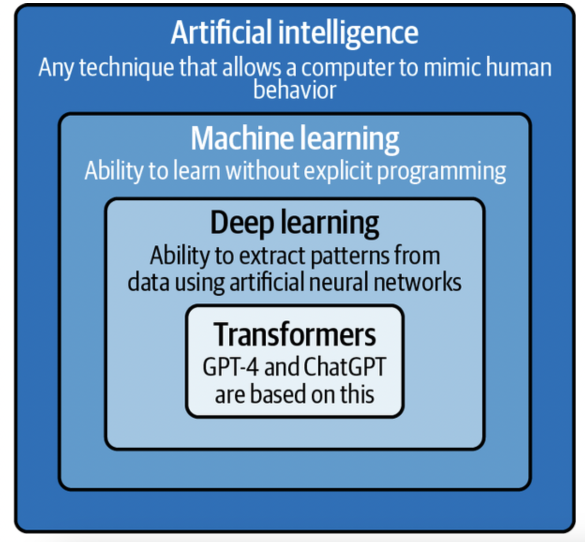
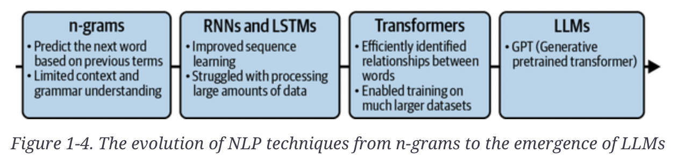

# Chapter 1. GPT-4 and ChatGPT Essentials

## Introduction to LLM

NLP is a subset of ML and AI.
ML is a subset of AI. In ML, we do not try to directly implement the decision rules used by the AI system. Instead, we try to develop algorithms that allow the system to learn by itself from examples. Deep learning is a branch of ML that focuses on algorithms inspired by the structure of the brain. These algorithms are called artificial neural networks. They can handle very large amounts of data and perform very well on tasks such as image and speech recognition and NLP.

**_GPT-4 and ChatGPT are based on a particular type of deep learning algorithm called transformers_**

### Transformer architecture

Transformers solved the problem of keeping the context of a word in a sentence (a problem with RNNs used for NLP before). The central pillar of this revolution is the attention mechanism. Instead of treating all words in a text sequence as equally important, the model “pays attention” to the most relevant terms for each step of its task.

**Cross-attention** helps the model determine the relevance of the different parts of the input text for accurately predicting the next word in the output text.

**Self-attention** refers to the ability of a model to focus on different parts of its input text. Self-attention helps the model build new concepts from these words.

Unlike the recurrent architecture, transformers also have the advantage of being easily parallelized. This means the Transformer architecture can process multiple parts of the input text simultaneously rather than sequentially.

